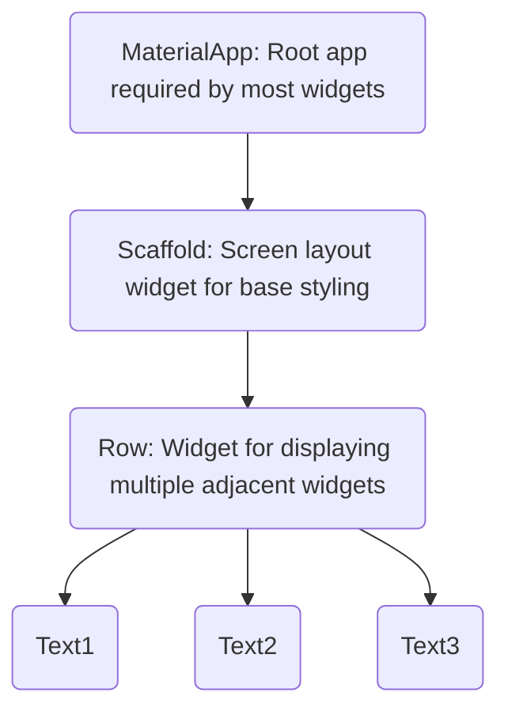

# First App
- We are going to work on making a program that allows us to have a visual Die on the screen (normal 6 sided) and roll it to generate a value on a button push
- We will use this to learn a lot of the base features with code, functionality, and widgets

---

# Project Layout
- Lets look at project layout
- Folders may change over time in projects but these are the base ones

---
# Lib
- Contains our main code in dart files
- Can contain multiple files that can be used together for projects
- Files are .dart files
	- These are the dart programs
	- Need to make sure we put these endings in when creating projects so projects actually run
	- Get auto correct and hinting from vs code
	- IF you dont see type hinting and auto complete, probably forgot to put the ending on the file

---
# Platform Folders
- We should also see Several platform folders
	- web, windows, android, macos, ios
- We dont do anything with these
	- flutter manages them
	- used under the hood with vms and publishing when using those platforms

---
# Build Folder
- Contains temp and output files that are created by flutter
- We dont work here, but they are important for generating builds for different platforms

---
# Test Folder
- Also contains dart files
- However we dont write app code here
- We can write automated tests here to test our app in various situations
	- We may get to this by the end of the course
	- Probably will not use for now, but we will leave it in the project

---
# Dotfiles and Folders
- Files/folders starting with a period are dotfiles
- This is the programmers way of marking these as "hidden" to the OS and wont normally show up in finder/explorer unless told to
- Just like in other contexts they contain configurations
- idea->android studio settings
- dart_tool is dart settings
- gitignore is used for github
- metadata is meta info about project
- analysis options is about linting and warning us about code
	- Valid code can be written in than one way
	- Projects some times have standards that are adhered to and can be configured here
- first_app.iml is metadata about building app for platforms
- pubspec allows you to add packages to project
	- 3rd party packages can be added and we will work in it later
- readme ->general info in markdown

---

# Diving into Main
- Lets look at our main.dart
- This is our entry point to the program
- This is code is parsed by dart
	- cannot be executed in itself by any other platform
- Flutter/dart takes this code and compiles it to native ios/machine/windows etc code (machine code)
- This compiled version is what is run on a mobile device

---

# Starting Fresh
- Lets Delete everything in the main.dart
	- We will code from scratch to go through how they work
- we start with this function
```dart
runApp();
```
- This function is provided by flutter is to show some user interface on the screen.
- Can read about it here [binding.dart](https://github.com/flutter/flutter/blob/f699eb0be0a0cfcf34e2b6c0e402a18d76a96f2e/packages/flutter/lib/src/widgets/binding.dart#L1078)
- above will have an error we need to fix

---

# Main
- Just like in Java, Dart has a main method
- Main method is simply the entry point that is called when a program is run. It is the initial set of instructions to execute from
- Lets modify
```dart
void main(){
	runApp();
}
```
 - Now we will see that this function is undefined
 - Just like java we need to import packages to use outside functions

---

# Importing
- In order to use outside packages and functions we can load them into our project
- First lets look into pubspec.yaml
	- we can manage dependencies here
	- A **dependency** is another project or set of code that our project is *dependent* on
	- Means we need it!
- We can see the following
```yaml
dependencies:
  flutter:
    sdk: flutter
```
- Its already added in, but this must exist for us to use flutter
- We also need to modify our dart file

---

# Back to main
- Dependencies being loaded just means that these files will be downloaded and set up by anyone who uses our app
- Does not mean they will be properly referenced in our file
- we use import followed by the package name
	- should start with package:
	- its a folder path (with normal /'s unlike java)
	- there should be some auto complete to make these easier (tab is your best friend)
```dart
import 'package:flutter/material.dart';

void main(){
	runApp();
}
```

---
# Pop Quiz
1. Which is the most important folder that we are working in most of the time?
2. Which file is the entry point for a Flutter App?
3. What is the purpose of the Dart Compiler?
4. What are the 2 pieces in a program needed to start a dart application?

---

# runApp cont.
- runApp needs arguments/parameters to know what to dispaly on the screen
- For runApp to display something it needs a thing to display
	- This is called a widget

---

# Widgets
- When Designing a flutter and dart app, we will not be using a visual drag and drop editor
- We use code blocks called **widgets**
- We combine and nest these to create an interface
- Due to nesting, we will end up with a widget tree
	- Root widget at the top, and children below it
	- Similar to the DOM if you did HTML/JS


---

# Widgets Cont
- Widgets will be nested
	- For example we can have a button that is clickable with a text widget inside so its a clickable text button
![[textbutton.png.png]]
- Flutter has many built in widgets
	- buttons
	- forms (ways to get users to fill out information)
	- layout
- We can also build custom widgets

---

# back to runApp again: for real this time
- We need to put a widget here
	- Which one?
	- How?
- We can look up widgets here:
- [Widget catalog | Flutter](https://docs.flutter.dev/ui/widgets)
- We will probably use 10-20 core widgets, and occasionally some others, but you can look at this for inspiration and ideas/documentation
- Just like the graph before, we will start by adding MaterialApp
	- Main widget we will use in almost all apps
```dart
import 'package:flutter/material.dart';
void main(){
  runApp(MaterialApp());
}
```
- What does MaterialApp() look like?
	- Has parenthesis-> What is it?
	- Sort of like a function or method. 
	- Its a Constructor!
- Widgets are built from classes and classes need constructors to start
- By itself this doesnt show anything, needs more arguments to run

---

# MaterialApp
- We need input arguments for this
- Dart has 2 methods for providing arguments to parameters
	- Positional (like java)
	- Named (this is new to us)
- Positional parameters are passed arguments based on their order
```dart
void divide(num1,num2)
{
	num1 / num2;
}
divide(1,2);
divide(2,1); //These both do something different 
```

Named 
```dart
void namedParamDivide({num1, num2})
{
  num1/num2;
}
namedParamDivide(num2:5, num1:3);
namedParamDivide(num2:5)
```
- Curly brackets denote the parameters are named and not ordered
- MaterialApp uses this strategy
```dart
void main(){
  runApp(MaterialApp(home: Text()));
}
```

---

# Named Params Cont
- **one very important difference** between positional and named arguments: 
	- positional parameters are required and must not be omitted 
	-  named arguments are optional and can be omitted.
```dart
void add({a, b}) { // a & b are named parameters (because of the curly braces)
	print(a + b); 
}

add(b: 5, a: 10); // 5 is used as a value for b, because it's assigned to that name; 10 is used as a value for a
```
In the example above, when using **named parameters**, you **could** call `add()` like this:

1. add();

or

1. add(b: 5);

- When using **positional parameters**, calling `add()` like this would be **invalid** and hence cause an **error**!

- You can change these behaviors, though. You can make positional arguments **optional** and named arguments **required**.

- Positional arguments can be made optional by wrapping them with square brackets (`[]`):

```dart
void add(a, [b]) { // b is optional
 print(a + b);
}
```

Once a parameter is optional, you can also assign a **default value** to it - this value would be used if no value is provided for the argument:

```dart
void add(a, [b = 5]) { // b is optional, 5 will be used as a default value
 print(a + b);
}
add(10); // b would still be 5 because it's not overwritten
add(10, 6); // here, b would be 6
```

- Default values can also be assigned to named parameters - which are optional by default:

```dart
void add({a, b = 5}) { // b has a default value of 5
 print(a + b); 
}  
```

5. add(b: 10); // for b, 10 would be used instead of 5; a has no default value and would be "null" here => a special value type you'll learn about throughout this course

You can also make named parameters required by using the built-in `required` keyword:

```dart
void add({required a, required b}) { // a & b are no longer optional
 print(a + b); 
}  
```

--- 

# Text Widget
- This has a required positional Parameter
- Needs some text!
	- Wrapped in quotes (single or double)
	- Single more common
```dart
void main(){
  runApp(MaterialApp(home: Text('Hello World!')));
}
```
- Can now run this ->Run->Debug->Choose a target device

---

# What Next?
- This is a first app
- Doesnt look great or do anything but we did learn about a lot of topics for dart
- Next Look at the Blue Squiglies
	- Not an error
	- Means there are suggested changes
	- Basically, Not Optimal
	- Suggests adding const
```dart
runApp(const MaterialApp(home: Text('Hello World!')));
```
- This is a keyword that turns the pointer to the constructed object into a constant memory location
- This optimizes runtime performance

---

# Const Cont.
![[memory.png]]
- Declaring an object assigns it in memory
- If we were to change this box later (without const) it would assign new memory dynamically and use that new space
- With const we are reusing the same spot in memory and redefining what is saved there
- Allows program to not duplicate things in memory to save space
- code editor will usually suggest this to us

---

# Widget Trees
- Lets make it look better
- More Widgets!
- Lets look at [Scaffold](https://api.flutter.dev/flutter/material/Scaffold-class.html)
- Sets up a good looking screen for the app
	- Things like background color/image
	- Style of text 
- We should wrap text with scaffold
	- This needs parameters too
	- Remember we can hover to see what
```dart
void main(){
  runApp(const MaterialApp(home: Scaffold(body: Text('Hello World'))));
}
```
- Better looking
	- White background
- But still not great
- Lets try to center this

---

# Layout Widgets
- [Layout widgets | Flutter](https://docs.flutter.dev/ui/widgets/layout)
- Center widget here sounds good
- More Wrapping
	- This is the widgets inside widgets inside widget
	- This is building our widget tree
- Right click text and refactor
	- Refactor is simply rewriting our code in a new way
	- Select wrap with center
	- Automatically will wrap it in a center widget
	- Note->Which argument is used by center?

---

# Confusing Trees
- This tree section is getting alittle wordy. 
	- Look at all those parenthesis
	- Yuck.
- Add a comma (,) after every closing parenthesis
	- Trust me bro
- Use the command pallet(ctrl/cmd + shift+p)
- Select format document command (alt+shift+f also works)
- Easy mode, also puts nice comments on closings
- Commas are instructing where to do this
- Essentially these are almost acting like arrays with commas for the next item at that level
- We only have 1 item so it looks wierd, but this is called a trailing comma and is allowed in some languages like dart
- It is considered best practice to include these

---

# Types
- Dart is a type safe langauge
- This means it all values have types 
- they protect the data inside of them to follow rules for those types
	- Similar to java
	![[type_safety.png]]

- We can see things can have multiple types
	- What do we call this?
- There are a bunch of base types we can use
- Can also use custom ones later (making our own classes)
- Types make sure we use the right type of data in the right place to prevent the program from crashing
- Try changing hello world to 29
	- Doesnt work
	- Text wants String, thats the only thing it can work with
	- Can wrap it as a string to make it work
```dart
void main() {
  runApp(
    const MaterialApp(
      home: Scaffold(
        body: Center(
          child: Text('Hello World!'),
        ),
      ),
    ),
  );
}
```

---

# Styling Widget
- Not all arguments are for widgets
- Some allow Styling
- We can use backgroundColor in Scaffold
	- If we look at backgroundColor it has the type
	- Color?
	- What does the ? mean?
```dart
home: Scaffold(
        backgroundColor: Colors.deepPurple,
        body: Center(
          child: Text('Hello World'),
        ),
      ),
```
- Can hover to use a colorpicker
- will change this to another object Color()
- Colors consit of R, G, B values and an Alpha channel
	- How much RGB and how much transparency
- 

---
# More Styling
- Looks different but not great
- Often times we will add a gradient to our backgrounds/colors
	- This is a transition between 1 color and another
	- creates a nice look and feel
- If we look at scaffold, it doesn't have an option for this type of parameter
- But we can add another widget that wraps center. 
	- Right click center, refactor, wrap in a container
- Containers are great for styling 
- However it now doesnt like the const call from before, lets remove it and move it to beore the center object

```dart
void main() {
  runApp(
    MaterialApp(
      home: Scaffold(
        body: Container(
          child: const Center(
            child: Text('Hello World!'),
          ),
        ),
      ),
    ),
  );
}
```

---

# Container
- Right now still giving us a warning
	- just becuase we haven't actually used container for anything yet
- Containers allow a **decoration** argument
	- This allows us to add styling to the container
- There are some prebuilt class types we can use here, lets try:
```dart
decoration: BoxDecoration(), //Add this in the top of container
```
- BoxDecoration also needs arguments, we will use the gradient i was mentioning
- Lets use a linearGradient for the gradient
- Again, more agruments
	- This is common in development and dart. We are working with a lot of prebuilt objects  all that need their own configurations
- Inside the linear gradient we will put in the colors argument
```dart
void main() {
  runApp(
    MaterialApp(
      home: Scaffold(
        body: Container(
          decoration: BoxDecoration(
            gradient: LinearGradient(
              colors: 
            ),
          ),
          child: const Center(
            child: Text('Hello World!'),
          ),
        ),
      ),
    ),
  );
}

```

---

# Using the Gradient 
- If we look at colors, what type does it require as an argument?
	- Lists... Hi Data structures, I missed you!
	- Just like in Java this is a Generic type
	- This is just a list of color objects, we just add some colors her
- We can provide a few colors, make them close but a little different for a nice effect. 
	- Use the color picker to do this
	- Make sure to have trailing commas on the array, parameter etc
- Lastly, we are getting a suggestion to put in a const on BoxDecoration, do that. 
	- Again this is to make it so that these things can be cached and stored for reuse so we are not wasting memory. 
```dart
void main() {
  runApp(
    MaterialApp(
      home: Scaffold(
        body: Container(
          decoration: const BoxDecoration(
            gradient: LinearGradient(
              colors: [
                Color.fromARGB(255, 26, 2, 80),
                const Color.fromARGB(255, 9, 1, 24),
                ],
            ),
          ),
          child: const Center(
            child: Text('Hello World!'),
          ),
        ),
      ),
    ),
  );
}
```

---

# Customizing Gradient 
- Right now we have a gradient from left to right if we run this
- We can customize how this transition happens
- Solution? 
	- More arguments
- We have a begin and end setting  on the gradient
- We can use the **begin** and **end** properties along with predefined **alignment** values (topLeft, bottomRight)
```dart
gradient: LinearGradient(
              colors: [
                Color.fromARGB(255, 12, 1, 39),
                Color.fromARGB(255, 63, 8, 165),
                ],
                begin: Alignment.topLeft,
                end: Alignment.bottomRight,
            ),
```

---

# Where do we find this stuff?
- This is a lot of stuff to pick up right now, 
- Just like anything by practicing we will become familiar with a lot of these properties and start learning what they are, and where we can find others. 
- But also we can use ctrl+space to get suggestions on what we can do
- Documentation is also good
	- we use a class or property for the first time, go to the flutter docs and look it up
	- Often has description and examples

---

# Changing the Text
- Lets change the text so its bigger and white for visibility
- Try it on your own for a minute
- Figure it out?

---

# Next Steps
- App looks better, but code is getting big
- This is ok, but realistically we want to do programmer things
- Abstract 
	- Take the functionality we did, turn them into building blocks that are reusable
- Call those blocks in place
- Now they are defined and reusable, 
	- think how classes work in Java
- In Dart we will be making widgets
- Think in these terms
	- We just designed a look and feel with this gradient
	- Probably we want our app to have a consistent look and feel, so we will want to do this elsewhere in our code
	- However, we don't want to have to write this out every time
- Reusability, Readability, and Maintainability are important!

---

# Custom Widgets
- Where do we start to make this then?
- OOP -> Make a class!
- Remember:
![[widgets_are_objects.png]]
- Dart is OOP
- We have primitive and class types just like Java
- Classes are the blueprint for objects
	- Will contain Data and Methods
	- Organize Data, give it behaviors
- We need to know define the class with its variables and behaviors

---

# Building a Widget class
- As a practice We want to make a container widget with our gradient applied 
- How do we make our class get all the features we need?
	- Inheritence
- We will Extend StatelessWidget
```dart
class GradientContainer extends StatelessWidget  {

}
```

- Yelling at us
	- Why? What type of class do we extend, but need to implement a method from?

---

# Implementing the Method

- Missing a method that needs to be implemented-> build
- This method must returns a widget, so we need to add this type to it
- Should also add an override tag to this widget
	- This is an annotation-> meta data about the method
	- Like a special comment
- Build needs a context parameter
- This method is called when it is passed as a parameter to something requiring a widget
- So we need it for it to work
- When it detects a widget in a widget tree, it will run its build method
- Build method will receive a context parameter (not used for now)
	- This is meta data about where this widget is in the tree and other similar info
```dart
class GradientContainer extends StatelessWidget {
  @override
  Widget build(context) {

  }
}
```

---

# Method body
- We need to put code in our build that says what it will do
- This is responsible for creating a widget on screen, so we need to return a widget when its done (hence the type, not void)
- We want to be able to return this look and feel
	- Right now this is done by the container we entered
- Lets abstract this into the build method of the class
- Afterward put this into the Main where we had the container before
```dart
void main() {
  runApp(
    MaterialApp(
      home: Scaffold(
        body: GradientContainer(),
      ),
    ),
  );
}

class GradientContainer extends StatelessWidget {
  @override
  Widget build(context) {
    return Container(
          decoration: const BoxDecoration(
            gradient: LinearGradient(
              colors: [
                Color.fromARGB(255, 12, 1, 39),
                Color.fromARGB(255, 63, 8, 165),
                ],
                begin: Alignment.topLeft,
                end: Alignment.bottomRight,
            ),
          ),
          child: const Center(
            child: Text('Hello World!'),
          ),
        );
  }
}
```

- Now its reusable!

---

# Fixing the suggestions
- We are told we should have a **key** parameter, and suggests making a constructor
- Just like Java, a default constructor is provided. We may want to add our own
- We can costumize this, however we just need to add a parameter to the constructor
```dart
GradientContainer(){
    //inializtion done here
    //We dont need to do this though
  }

```

- Key is a named argument for this parameter, so we will use {}
- This is required by StatelessWidget, this is why we are suggested it
- We need to forward it to StatelessWidget (The parent class)
- How do we talk to parent Classes?

---

# Mom, help!
- Super class is the parent class(mom)
- Talk to it with super just like java. We have a few options for passing this parameter to the parent constructor
```dart
GradientContainer({key}): super(key:key);
//or
GradientContainer({super.key}); //easier in this case
```
- Still yelling at us, just needs a const now. 
- We are just telling flutter/dart that we can optimize this class and object in memory
- Can do it on Material App also

---

# Cleaning up
- Now we have a dart class in this class
	- A little sloppy
- Lets move to its own file (class in its own file like java)
- Make a new file (names are lower case, underscore separated)
- Needs a flutter import at the top (we lost this in the move)
- Gradient container in main doesnt know about this class yet though
	- So import it as well
```dart
import 'package:first_app/gradient_container.dart'; //make sure it matches your package(folder) name!
```

---
# Make your own widget!
- Make a new widget for the text source
- We will use this in the Center widget
- Abstract the text widget styling we did into its own class

---

# Understanding Variables

- Variables are just data containers (as in all langauges)
- Lets take some hard coded data and use variables for them
- Look at gradient container
- We can use this on begin and end
- They are created with the var keyword
```dart
var startAlignment = Alignment.topLeft;
var endAlignment = Alignment.bottomRight;
```

---

# Changing Values
- As variables the value of these can change
- However we set the BoxDecoration as constant, but there is the possibility that this can change
- This would contradict each other, so we have it yelling at us
- We can remove the const keyword from box, add it to the colors array

---

# Types
- IF you noticed, we are missing types!
- We just use the var keyword
- Dart language uses type inferencing
	- It can assume and assign a type based on what it is saved into it when created. 
- We can see it did assign for both of these the allignment type. 
- Can be dynamic if we dont pick an initial value 
	- Just means we will pick a type later. 
	- Can lead to bugs, should avoid this
	- Replace it with type in this case
```dart
var startAlignment; //dynamic type
Alignment startAlignment; //Assigned to an alignment type, but errors
Alignment? startAlignment; //Assigned to alignment type or null type
```

---
# Finals and Consts
- We are not changing the values of startAlignment and endAlignment
	- They really don't need to be variables
- We can use **final** in this case
	- final means this will never receive a new value
	- Also makes sure a partner working on this will not accidently change the value in another file etc
- We can also use const
	- These are constant data containers
	- Its not re assignable, but provides extra info
	- We are telling dart that the data on the right side of the equals is a compile time constant
- When to choose each?
	- If i have a definite value at compile time that is not changing -> const
	- If i know it doesnt change, but it is calculated through a function or something similar -> final
- We should use const here, these are both actual compile time values that can be locked in
- Can also change the BoxDecoration and colors back to how they were

---

# Instance Variables
- We just made variables outside of our class in gradient container
- Lets make other code reusable in our widget
- We still have 'Hello World' hard coded in our text widget
- In other words, we want this widget to be reusable, however it only shows hello world
- We want to use a parameter here!
- Where do we add this parameter for our widget?

---

# Modifying the Widget
- We can add the parameter in the constructor
- We can do this as a named or positional parameter. 
- Lets do positional
```dart
const TextWidget(text,{super.key}); //If we do this, what type is text?
const TextWidget(String text,{super.key}); //now what type is it?
```

- We also need to modify the call in the container widget
```dart
child: TextWidget('Hello World!')
```

- Lastly we need to actually do something with this variable
- If we try to just use its name where hello world was, it fails
- Right now the data is passed in but not assigned to an internal **class variable**
	- or **instance variable**
	- 
```dart
const TextWidget(text,{super.key}): outputText = text;
  String outputText; //We can do it like this, however like before this is verbose
```
- We have a common pattern
```dart
  const TextWidget(this.text,{super.key});
  String text; //Looks for a variable called text, and passes that argument into that variable
```

---

# Cleaning it up
- We are making that constructor changeable in its behavior
	- cant be const anymore
- Same on the Widget.build
- We can also use final on string as we are not changing it
```dart
class TextWidget extends StatelessWidget{
  const TextWidget(this.text,{super.key});
  final String text;
  @override
  Widget build(context){
    return  Text(
      text,
      style: const TextStyle(
        color: Colors.white,
        fontSize: 28,
      ),
    );
  }
}
```


---

# Reusability
- Now that we modified the text widget to be more reusable by accepting arguments, lets try this again
- Try for gradient container
- We have hard coded colors
- Maybe on a bigger app we want this style to be used but with different colors
- Lets try taking those as parameters
- There are a few solutions!

---

# Getting the app going!
- We need to get the Die on the screen
- We can do this with showing images and functions
- Grab the zip file from canvas
- Add an assets folder to our project
- add an images subfolder and put the images there
- We also need to modify pubspec
	- This file tells our project about the structure so we need to notify it about this new folder
- Look for the line about assets
```yaml
  assets:
    - assets/images/dice-1.png
    - assets/images/dice-2.png
    - assets/images/dice-3.png
    - assets/images/dice-4.png
    - assets/images/dice-5.png
    - assets/images/dice-6.png
```

- They are now usable in our code
---

# Adding to our code
- We have text showing
- We were just using this to learn about dart a little, but this is not needed for our app
- Lets remove the text widget in center
- Here we can use an Image object
	- It has multiple constructors, 1 takes an image loader
	- Another i can provide a local asset (essentially overloaded constructors from java but with names)
```dart
child:  Center(
            child: Image.asset('assets/images/dice-2.png')
          ),
```
- Can also get rid of our import at the top
- Try running and looking now
- A little big, we can clean this up with a width argument in the constructor
```dart
child:  Center(
            child: Image.asset(
              'assets/images/dice-2.png',
               width: 200,
            )
          ),
```

---

# Dovie'andi se tovya sagain : Time to Toss the dice

- We need a button now to make this roll
- So now we need multiple widgets to do this 
- Center only takes one widget, what can we do?
- Here we can add a column widget
![[rows_and_cols.png]]

- Col takes a list as a parameter, this is a list of widget that we want in the column

---

# Adding the Col
- Place the col in
- It requires a list called children
- place our image as the first element in children
- Now we need to add a button
```dart
child: Center(
        child: Column(children: [
          Image.asset(
            'assets/images/dice-2.png',
            width: 200,
          ),
          
        ]),
      ),
```
---

# Buttons
- There are multiple types buttons in dart
- ElevatedButton -> has a color and slight shadow
- Outlined button -> no background, but border
- TextButton -> simple one with some text (we will use this)
- lets add it in
```dart
TextButton(onPressed: onPressed, child: child)
```
- This takes 2 arguments
- Child is simple, its a sub widget that we will use to show text, so we can add a text widget and set it
- onPressed wants a function or null as a parameter
	- functions in dart are objects
	- We can pass them as parameters
	- we will look at doing this in place first

---

# In place functions
- This is an anonymous function
	- Function without a name
	- we are just defining it here and now
- It is called when the button is pressed
```dart
onPressed: () {},
```
- We can define parameters in the parens and logic in the curly braces
- Alternatively we can define a method and call that
```dart
 void rollDice()
  {
    
  } //This would be defined in the GradientContainer class as a method of that class and called in the onPressed
```
- If we run, it looks a little off. We need to fix styling and add logic

---
# Using Colum
- We have the Column inside the Center widget, why is it not centered?
- It is! Its just big (Takes up the whole center part of the screen top to bot)
- We can modify this with another parameter for the column->mainAxisSize
- This has some pre defined options MainAxisSize.max and MainAxisSize.min
- If we use min, it will use the minimum size to hold the content inside of it
```dart
child: Column(
          mainAxisSize:MainAxisSize.min ,
          children: [
            Image.asset(
              'assets/images/dice-2.png',
              width: 200,
            ),
            TextButton(
              onPressed: rollDice,
              child: const Text('Toss the Dice'),
            )
          ],
        ),
```

---

# Styling the button
- We can modify the style of the textbutton
- We can add a style parameter to the TextButton constructor
- Use this with TextButton.styleFrom(), lets do a few things
```dart
TextButton(
              onPressed: rollDice,
              style: TextButton.styleFrom(
                foregroundColor: Colors.white,
                textStyle: const TextStyle(
                  fontSize: 28,
                )
              ),
              child: const Text('Toss the Dice'),
            )
```
- I just made the foreground white (the text in this case on this object), and gave it a larger font size to make it more visible
- Run it and see
- Now we can add more spacing

---

# Padding
- in Style From, we can add padding
- **Padding** is space inside of a widget between a widgets outside border and its inside content
- We add this with he padding parameter
- Requires an EdgeInsetsGeometry type
	- all will do all directions
	- can also do only and pass a side. 
```dart 
TextButton(
              onPressed: rollDice,
              style: TextButton.styleFrom(
                padding: const EdgeInsets.only(top: 20),
                foregroundColor: Colors.white,
                textStyle: const TextStyle(
                  fontSize: 28,
                )
              ),
              child: const Text('Toss the Dice'),
            )
```
- Alternatively we can add a sized box widget
	- This is just going to be a blank widget between the 2 widgets in the column
	- We can set the size of this to 20. Same effect different method of doing it

---

# Dice Method
- We just make it so the call of the function changes the dice image
- As an example, changing dice-2 to dice-4 etc
- We can use a variable for this below our finals. 
```dart
var activeDiceImage = 'assets/images/dice-2.png';
```
- What is the problem when we do this?
	- Variable means changing app
	- This means no longer can use a const constructor
	- Which means memory management needs to change
- Then we can edit code to change the variable and use that variable in the Image.asset
```dart
void rollDice() {
    activeDiceImage = 'assets/images/dice-4.png';
  }
//and
Image.asset(
              activeDiceImage,
              width: 200,
            ),
```

- Fix the remaining errors and Lets try it!

---

# Our Function
- Maybe its not running?
- Lets try logging
	- Print something out to see if that function is being called
```dart
  void rollDice() {
    activeDiceImage = 'assets/images/dice-4.png';
    print('Rolling dice...');
  }
```
- Try it again
	- We see the print, but no image change
	- Why?

---

# Stateless widget
- Stateless widgets do not allow us to change the state of the the widget
	- It doesnt keep track of a state (or set of values and variable that may change over time)
- So this is the wrong widget! Sorry =(
- Guess what the opposite of this widget is?
- Stateful!
- So, the only thing that is changing is the button and image, lets make them stateful
- I'll make a new file
	- dice_roller.dart

---

# Stateful widget class
- Create the class and extend the stateful widget
- Definition is a little different. 
	- This has no build method
	- We need a **createState** method
	- This returns a **state** object
	- State is a generic and should match the type of the object its generating the state for
```dart
class DiceRoller extends StatefulWidget{
  @override
  State<DiceRoller> createState(){

  }
}
```

 ---

# State Class
 
-  We also need another class which is the state itself
- We need to define this and it is conventionally done as so
```dart
class _DiceRollerState
```
- The underscore means its private (only useable in this file)
- This is an private internal class
- This class will have the build method
```dart
class DiceRoller extends StatefulWidget{
  @override
  State<DiceRoller> createState(){
    return 
  }
}
class _DiceRollerState extends State<DiceRoller>{
  build(){

  }
}
```
- 
- Everything now will be same as in the stateless widget
- We want to finish the build method and return the column from before

---

# Copying over
- We now need to start moving that old code into this file
```dart
class DiceRoller extends StatefulWidget{
  @override
  State<DiceRoller> createState(){

  }
}
class _DiceRollerState extends State<DiceRoller>{
  @override
  Widget build(context){
    return Column(
          mainAxisSize:MainAxisSize.min ,
          children: [
            Image.asset(
              activeDiceImage,
              width: 200,
            ),
            const SizedBox(height: 20,),
            TextButton(
              onPressed: rollDice,
              style: TextButton.styleFrom(
                //padding: const EdgeInsets.only(top: 20),
                foregroundColor: Colors.white,
                textStyle: const TextStyle(
                  fontSize: 28,
                )
              ),
              child: const Text('Toss the Dice'),
            )
          ],
        ),
  }
}
```
- We have something like this, but with errors
	- What is it detecting as wrong?
	- Why?
```dart
class DiceRoller extends StatefulWidget{
  const DiceRoller({super.key});
  
  @override
  State<DiceRoller> createState(){
    return _DiceRollerState();
  }
}
```
- We can also finish off the diceroller
- This is just returning the state and setting up the nice constructor with the key

---

# Final changes in Gardient
- Lets move over that variable and function
- cut it
- Remake const (sorry i know we are doing this a lot!)
	- Do this in main also
- Put the cut code into the \_DiceRollerState
```dart
class _DiceRollerState extends State<DiceRoller>{

  var activeDiceImage = 'assets/images/dice-2.png';

  void rollDice() {
    activeDiceImage = 'assets/images/dice-4.png';
    print('Rolling dice...');
  }
```
- Looks good, one last fix (what is it?)
- Now we just need to put this into gradient
---
# In Gradient Container
- Add the constructor in the child for center and import
```dart
import 'package:first_app/dice_roller.dart';
//and
child: Center(
        child: DiceRoller(),
      ),

```
- All fixed now, lets try it!

---
# Not enough
- Flutter is just ignoring what we did and not re evaluating the build method by default
- Build method in the Widget needs to get re executed, rebuilt when we click
- Just because we changed the variable, doesn't mean it is re running the method that is setting the object to that value
- We have a special function we need to call in the method
	- setSate();
- This takes a function as a parameter, typically an anonymous one
```dart
void rollDice() {
    setState( () {
      activeDiceImage = 'assets/images/dice-4.png';
    });
    print('Rolling dice...');
  }
```
- Now try... for real this time, no tricks

---

# Next Steps
- Right now its just doing 1 change
- We want to do a random number and set the image
```dart
import 'dart:math';
```
- import this in the dice_roller
- Has the random method
```dart
var rolledValue = Random().nextInt(6) + 1;
```
- This will generate a random between 1 and 6
	- 6 value lets us do 0 to 5 ( its non  inclusive)
	- and add 1
	- Similar to java
- Now we just use this to build a string
- Dart is nicer than java, we don't have to do concatenation nonsense
- Dart has string interpolation and can have variables directly in strings
	- we do this with the '$'
```dart
void rollDice() {
    var rolledValue = Random().nextInt(6) + 1;
    setState( () {
      activeDiceImage = 'assets/images/dice-$rolledValue.png';
    });
    print('Rolling dice...');
  }
```

--- 

# Lets make it better
- We can take this, create a variable, and use that variable in the widget and random number
```dart
class _DiceRollerState extends State<DiceRoller>{

  var currentDiceRoll = 2;

  void rollDice() {
    setState( () {
      currentDiceRoll = Random().nextInt(6) + 1;
    });
    print('Rolling dice...');
  }

  @override
  Widget build(context){
    return Column(
      mainAxisSize:MainAxisSize.min ,
      children: [
        Image.asset(
          'assets/images/dice-$currentDiceRoll.png',
          width: 200,
        ),
        const SizedBox(height: 20,),
        TextButton(
          onPressed: rollDice,
          style: TextButton.styleFrom(
            //padding: const EdgeInsets.only(top: 20),
            foregroundColor: Colors.white,
            textStyle: const TextStyle(
              fontSize: 28,
            )
          ),
          child: const Text('Toss the Dice'),
        )
      ],
    );
  }
}
```

- This is a little cleaner
- we just have 1 variable and this is used for the image
---
# Optimizing the random
- When we call that constructor for random, it wil generate a random object every time
- We can just make 1 use of this and call it. 
```dart
final randomizer = Random();
  var currentDiceRoll = 2;

  void rollDice() {
    setState( () {
      currentDiceRoll = randomizer.nextInt(6) + 1;
    });
    print('Rolling dice...');
  }
```
- This will make only 1 version of random in memory and go throug the random numbers
- Can also put this outside the class all together

---
